# **USC CSCI 520: Computer Animation and Simulation**  
#### \- taught by Dr. Jernej Barbič  

## **Programming Assignment 2: Motion Capture Interpolation**  

    Operating System: macOS 10.15
    Source Code Editor: Sublime Text, Version 3.2.2, Build 3211
    Programming Language: C++
    API: OpenGL (Compatibility Profile)

### **ASSIGNMENT DETAILS:**
- Look into the file ```Assignment-2-details.pdf```  
                OR
- Go to [](http://barbic.usc.edu/cs520-s20/assign2/index.html)

### **HOW TO EXECUTE THE CODE (For macOS):**
1. Compile using the command: ```make```.  
Note: To delete all the object files and executables:```make clean```

2. To run any or both of player and interpolator, get inside ```mocapPlayer-starter``` folder.  
Then,  
To run the player:  
    ```
    ./mocapPlayer
    ```
    To run the interpolator(sample):  
    ```
    ./interpolate 135-martialArts.asf 135_06-martialArts.amc b q 40 135_06-martialArts-bq-N40.amc
    ```  

### **OBJECTIVE:**
The objective of this assignment is to implement three interpolation schemes (Bezier interpolation for Euler angles, Linear interpolation with SLERPing of quaternions, Bezier interpolation with SLERPing of quaternions) to interpolate human motion data (stored in .amc files) from an Optical mocap system.
The human model or skeleton (stored in .asf files) is represented as a hierarchy of nodes (a root node and several children nodes for various joints of the skeleton). The .amc files use Euler angles to represent joint rotations.  
The interpolation program takes .asf and .amc files, and number of frames to be dropped(N) as input. It keeps the first and every Nth keyframes and drops the rest. It then generates the intermediate frames using interpolation method and angle representation as per user choice.  
The mocap player can be used to upload multiple skeletons with frames computed using different interpolation techniques to compare them.  
Graphs are plotted for comparative study using motion files generated with different interpolation techniques and a fixed number of frames dropped.  

*Note: In Linear Quaternions I used Linear Euler for the root node (as per Assignment Requirements).*

### **ACCOMPLISHMENTS - CORE CREDITS:**
1. Represented the joint angles (including root orientation) using quaternions.  
2. Coded routines to convert Euler angles to quaternions, quaternions to Euler angles, SLERP interpolation for quaternions, Double and  
3. Implemented the three interpolation methods:  
a. Bezier interpolation for Euler angles  
b. Linear interpolation with SLERPing of quaternions  
c. Bezier interpolation with SLERPing of quaternions  
4. Implemented DeCasteljau construction with Euler, and on Quaternion Sphere (using SLERP).  

### **ACCOMPLISHMENTS - EXTRA CREDITS:**
1. **Displaying and Analyzing the computation time of the different interpolation techniques:**  
I used “performanceCounter.h” and computed the time taken by the different interpolation techniques.  
For “131_04-dance.amc" with N = 20:  
As we can see below, Linear Interpolation Euler (0.007904) < Bezier Interpolation Euler (0.031804) < Linear Interpolation SLERP Quaternion (0.068853) < Bezier Interpolation SLERP Quaternion (0.139704).  
  
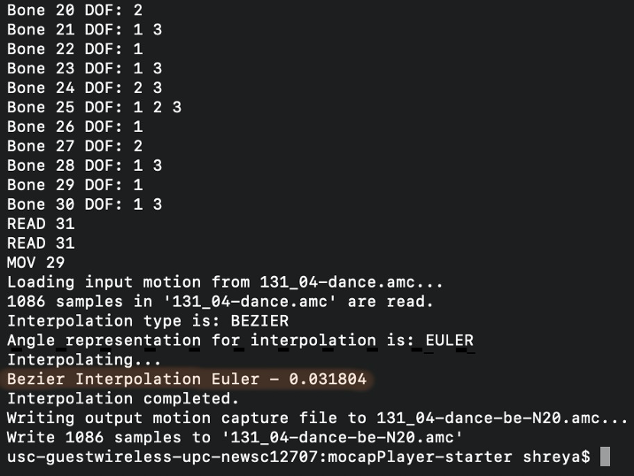  
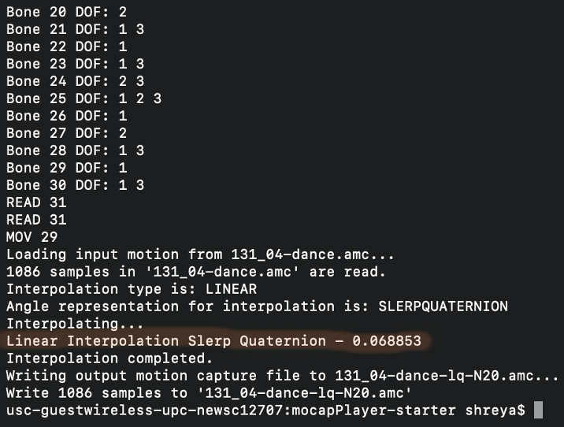  
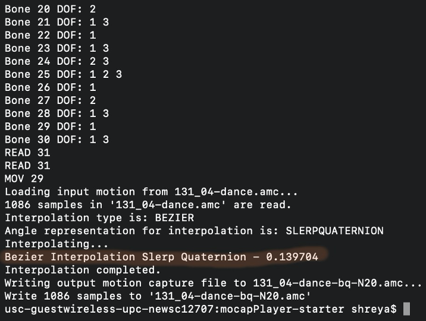  
>**Analysis:**  
Both the Euler representations take less time than the SLERP Quaternion representations because SLERP requires trigonometric calculations.  
Both the Linear interpolations take less time than the Bezier interpolations as the latter is more complex and requires many steps in calculation.  

2. **Used LERP for very small angles between two quaternions in SLERP:**  
LERP is faster than SLERP computationally, so I was wondering if it would be a good idea to do the calculation for θ -> 0 using LERP instead of SLERP in the Slerp function. So I re-implemented SLERP using LERP for θ -> 0 (but not equal to 0).  
Then I drew graph comparison between SLERP quaternion and SLERP&LERP quaternion for both Linear (in ‘graph/graph\ 5’ folder) and Bezier (in ‘graph/graph\ 6’ folder) interpolation methods.  
  
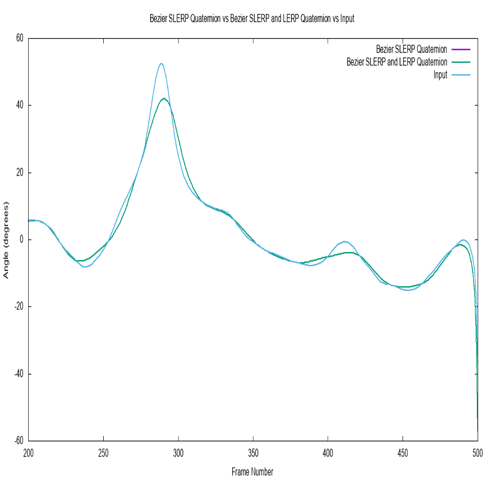  
>**Analysis:**  
The graphs (as you can see above), overlapped completely (to the eye). So, I looked into the corresponding .amc files and found that out of 300 frames one or two vary in the thousandths or ten-thousandths decimal places. So I also recorded the computation time for both the methods and found that the SLERP&LERP methods for both Linear and Bezier are taking more time than the SLERP methods for Linear and Bezier. So I deduced, SLERP&LERP is taking more time since the result has to be normalized again where LERP is used, which is not the case where SLERP is used.  
>
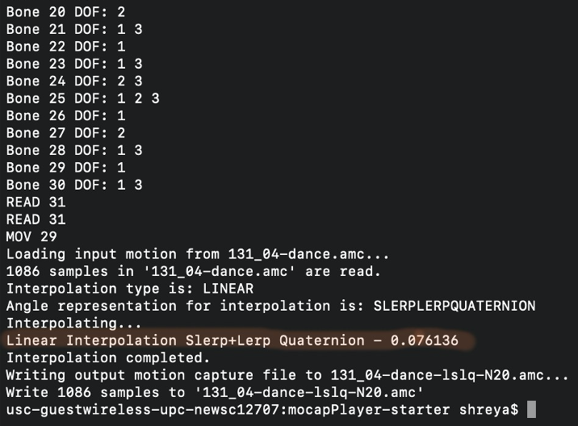  
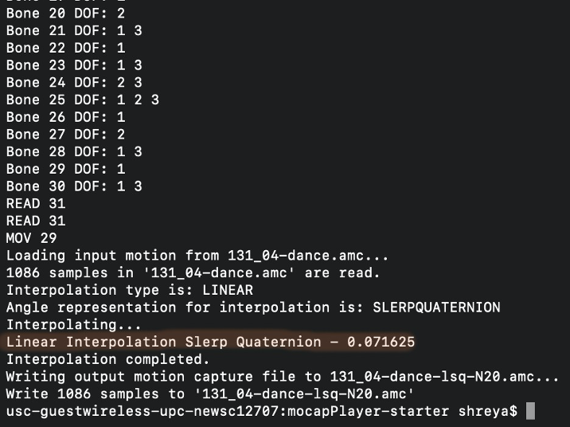  
>
Linear Interpolation SLERP+LERP Quaternion (0.076136) > Linear Interpolation SLERP Quaternion (0.071625)  
>
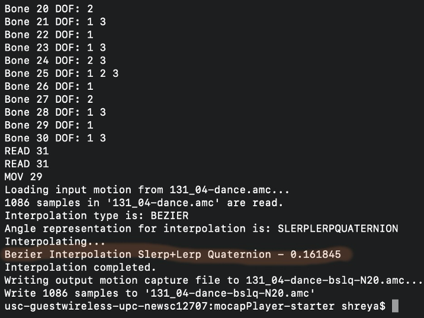  
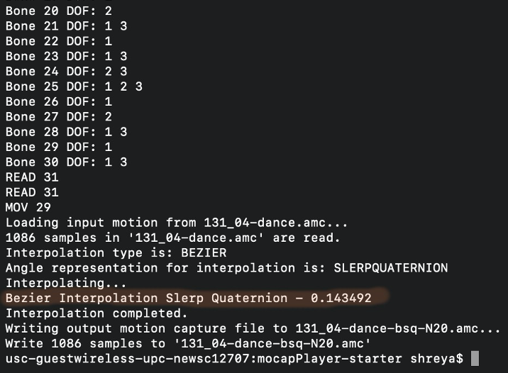  
>
Bezier Interpolation SLERP+LERP Quaternion (0.161845) > Bezier Interpolation SLERP Quaternion (0.143492)  

3. **Changed ground pattern from checker to concentric squares:**  
Initially I was trying to add a fade-away effect from center of concentric squares for the ground, but the fading was being too uniform, and the concentric squares weren’t vividly visible. So, I changed it to alternate between two shades (a dark and a light one).  

4. **FLTK features added:**  
  - Added a button ‘Fly Cam’ to zoom-out->rotate->zoom-in the camera back to initial position to show the ground pattern added. On clicking ‘Fly Cam’ button, a message is going to pop up saying “This is to show the PATTERN on the GROUND: concentric squares”. Click ‘Close’ and the animation will start.  
  - Also changed the color of the window and labels of value inputs.  

5. **Color changes for skeleton, ground, background, fog:**  
Changed color of skeleton for every color of joints so that the differences are visible more prominently. Changed ground color, background color and fog color.  

### **GRAPHS AND OBSERVATIONS:**
#### GRAPHS:
*Graphs #1, #2 are  for lfemur joint, rotation around X axis, frames 600-800, for N=20, for 131_04-dance.amc input file.*  

> ##### *GRAPH#1:*
> *Compares linear Euler to Bezier Euler interpolation (and input)*  
>
> 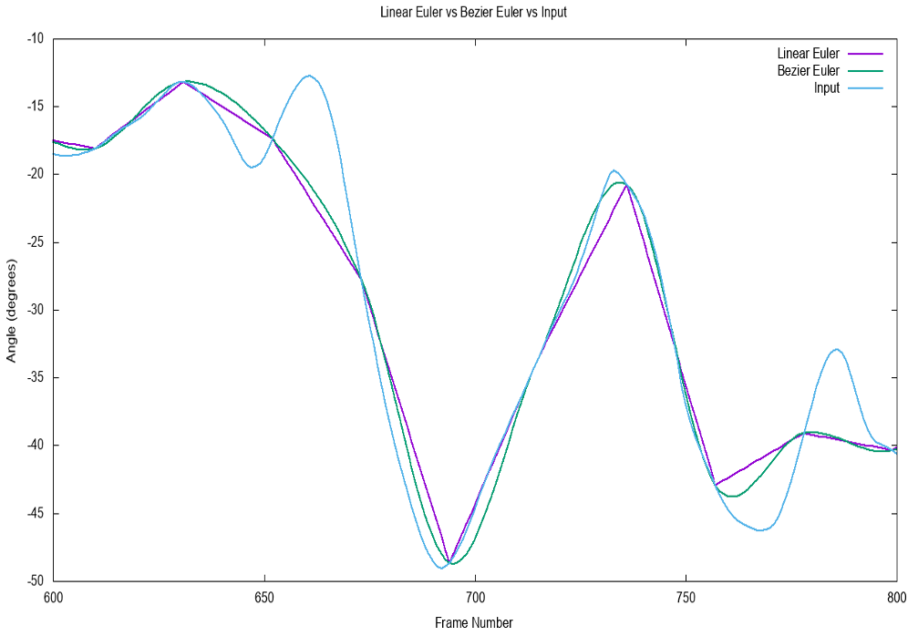  
>
> The Linear Euler interpolation is like straight lines between the keyframes whereas the Bezier Euler interpolation is smooth curves between the keyframes. However, both are quite deflected from the ground truth.  

> ##### *GRAPH#2:*
> *Compares SLERP quaternion to Bezier SLERP quaternion interpolation (and input)*  
>
> 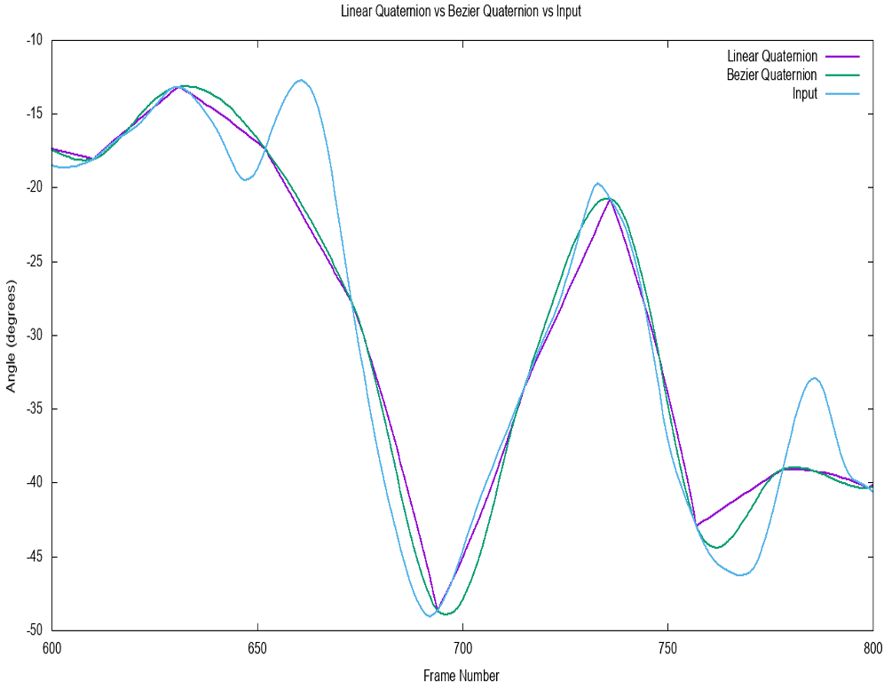  
>
> The Linear SLERP Quaternion interpolation is like straight lines between the keyframes whereas the Bezier SLERP Quaternion interpolation is smooth curves between the keyframes. However, both are quite deflected from the ground truth.  

*Graphs #3, #4 are for root joint, rotation around Z axis, frames 200-500, for N=20, for 131_04-dance.amc input file.*  

> ##### *GRAPH#3:*
> *Compares linear Euler to SLERP quaternion (and input)*  
>
> 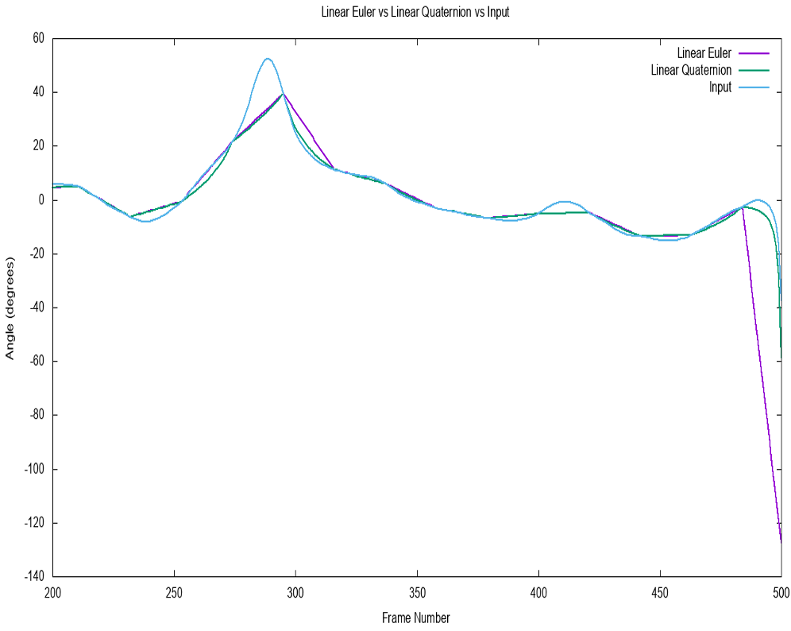  
>
> The Linear Euler interpolation is like straight lines between the keyframes whereas the Linear SLERP Quaternion interpolation is smooth curves between the keyframes.  

> ##### *GRAPH#4:*
> *Compares Bezier Euler to Bezier SLERP quaternion (and input)*  
>
> 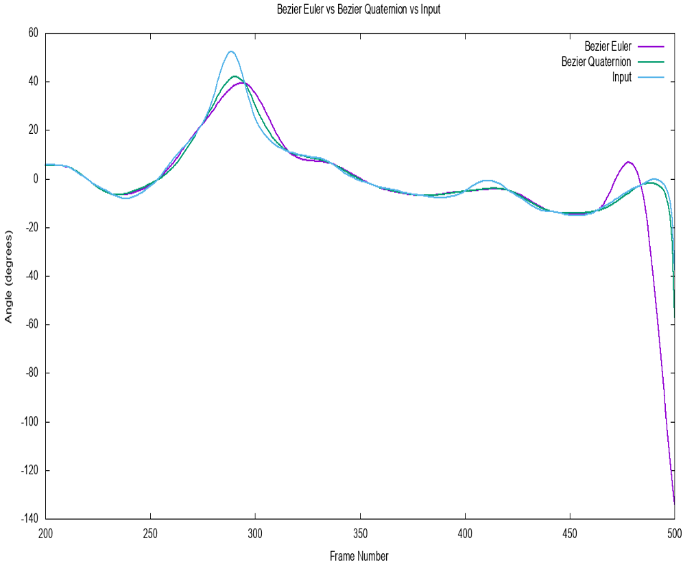  
>
> Both the Bezier Euler interpolation and Bezier SLERP Quaternion interpolation are smooth curves between the keyframes. However, Bezier SLERP Quaternion interpolation is closer to the ground truth, therefore is better of the two.  

#### OTHER OBSERVATIONS:
1. **I realized that Double(p,q) is equivalent to Slerp(p,q,2).**  

        Slerp(p,q,2) = [sin⁡((1-2)θ)/sin⁡θ]*p + [sin⁡(2θ)/sin⁡θ]*q  
                     = [-sinθ/sin⁡θ]*p + [(2sin⁡θcos⁡θ)/sin⁡θ]*q  
                     = -p + 2cos⁡θ*q  
                     = 2(p.q)q-p  
                     = Double(p,q)  
    But I computed “2(p.q)q – p” for Double(p,q) instead of using the Slerp function as it would be computationally more expensive because of the trigonometric calculations.  
2. ##### **Euler:**  
    ###### *Advantages:*  
    > - Easier to understand and use.  
    > - Computation is faster.  
	
    ###### *Disdvantages:*  
    > - Euler angles have Gimbal lock problem.  
    > - They produce strange rotations.  
    
    ##### **Quaternions:**  
    ###### *Advantages:*  
    > - Smooth rotations.  
    > - For a given axis and angle, it is easier to construct the corresponding quaternion, and conversely, for a given quaternion it is easier to read the axis and the angle. Both of these are much harder with Euler Angles.  
	
    ###### *Disdvantages:*  
    > - Computationally heavy specially when used with SLERP.  
    
    ##### **Linear:**
    ###### *Advantages:*  
    > - Easier to use.  
    > - Computation is faster.  
	
    ###### *Disdvantages:*  
    > - Straight sharp motion.  

    ##### **Bezier:**
    ###### *Advantages:*  
    > - Smooth curves.
	
    ###### *Disdvantages:*  
    > - Complex to implement.
    > - Computationally heavier than Linear.  
3. While slerping, if cos θ is negative (θ being the angle between two quaternions q1 and q2), it means that -q2 is nearer to q1.  
If cos θ is not negative then q2 is nearer to q1 than -q2.  
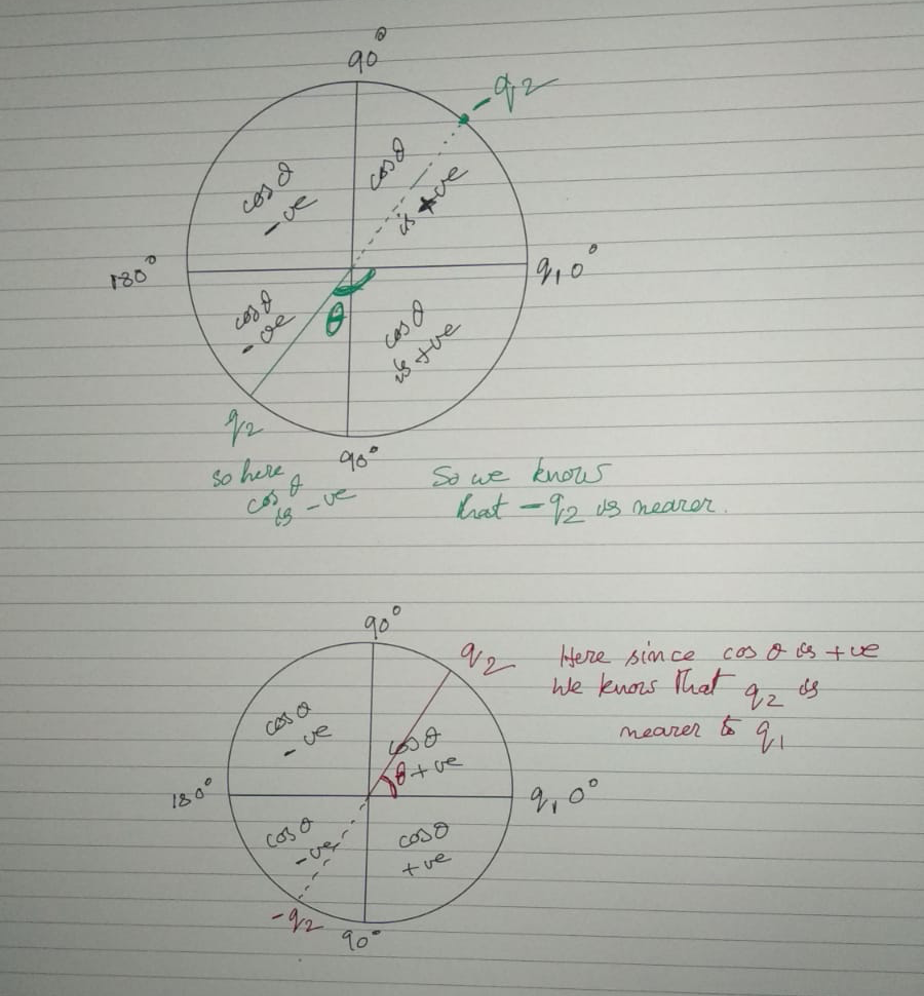  

### **NECESSARY FILES AND FOLDERS LOCATIONS:**
- The graphs are inside:  
    - Graph#1: ```graph/graph\ 1```  
    - Graph#2: ```graph/graph\ 2```  
    - Graph#3: ```graph/graph\ 3```  
    - Graph#4: ```graph/graph\ 4```  
- The computation time snapshots are inside: ```computation\ time\ of\ internpolation\ techniques```  

### **EXHIBIT:**
  
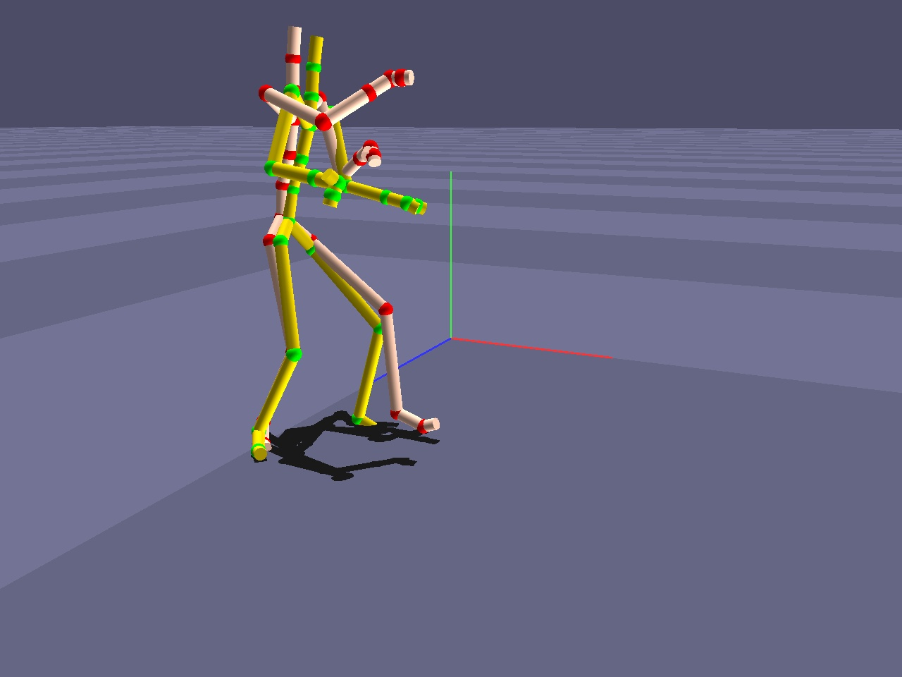  
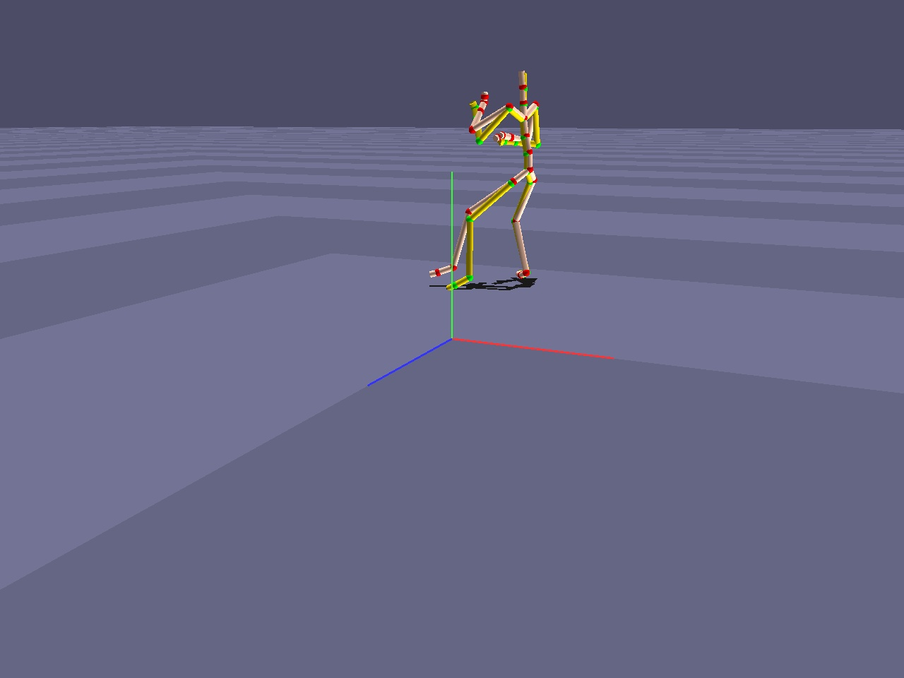   
[](https://www.youtube.com/watch?v=6tzOovB9RX0)